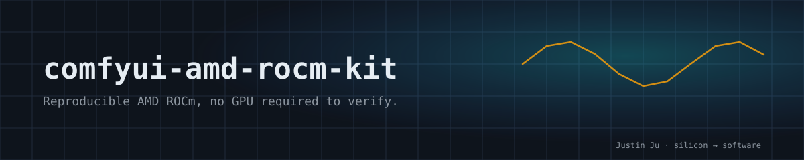

<p align="center">
  
</p>

# ComfyUI AMD ROCm Kit

**Reproducible AMD ROCm, no GPU required to verify.**
**可复现的 ROCm 部署,无 GPU 也能验证。**

A reproducible ComfyUI deployment layer for Windows on AMD Radeon RX 9070 XT (16GB) with 32GB RAM. It does not copy ComfyUI or model files — it pins tested core versions, custom nodes, model manifests, workflows and acceptance scripts.

面向 Windows + AMD Radeon RX 9070 XT 16GB 的可复现 ComfyUI 部署层。不复制 ComfyUI 或模型文件,而是锁定经过实测的核心版本、自定义节点、模型清单、工作流和验收脚本。

## Verified capabilities / 已验证能力

- Flux 2 Klein 4B:快速预览和自然语言图片编辑。
- Flux 2 Klein 9B:高质量图片生成与多参考工作流。
- LTX-2.3 22B Q3:512×704 图生视频、24fps、空间放大、H.264 和可选 AAC 音频。
- SAM1、DWPose、Impact Pack、ReActor、PuLID 和 Ultimate SD Upscale 辅助链。
- RX 9070 XT 上的 PyTorch 2.9.1 + ROCm 7.2.1 本机推理。

## Quick start / 最短使用路径

```powershell
git clone https://github.com/Justin-Ju-0413/comfyui-amd-rocm-kit.git
cd comfyui-amd-rocm-kit
powershell -ExecutionPolicy Bypass -File .\scripts\bootstrap.ps1
powershell -ExecutionPolicy Bypass -File .\scripts\doctor.ps1
.\scripts\start-image.bat
```

默认运行目录为仓库下的 `runtime/ComfyUI`,也可以先设置 `COMFYUI_ROOT` 指向现有安装。浏览器打开 <http://127.0.0.1:8188>。详细步骤见 [新手操作指南](docs/新手操作指南.md)。

没有 AMD GPU 时可运行 `powershell -File scripts/doctor.ps1 -StaticOnly`,验证清单、JSON、脚本与仓库边界。硬件支持范围见 [兼容性矩阵](docs/COMPATIBILITY.md);静态检查通过不代表 GPU 工作流已运行。

## Verification & baseline / 验证与基线

- CI 无 GPU 静态检查:`doctor.ps1 -StaticOnly`(manifest / JSON / scripts / repo boundary)
- 硬件结果模板:[hardware-result Issue template](.github/ISSUE_TEMPLATE/hardware_result.yml)
- 当前基线:ComfyUI `f3a36e74` · Python 3.12 · PyTorch 2.9.1+rocm7.2.1 · RX 9070 XT ~15.92GB 可用显存
- LTX 实测:512×704、49 帧、24fps、2.04 秒、H.264/yuv420p;音频档为 AAC 48kHz 双声道

## What is not in this repo / 仓库不包含什么

模型、虚拟环境、用户输入、生成输出、缓存、令牌和本机专用配置不会进入 Git。模型由 `config/models.manifest.json` 描述,通过 `scripts/download-models.ps1` 按组下载并校验。

## Agent-driven development / AI 接力开发

所有代理先阅读 `AGENTS.md`、`PROJECT_STATE.md`、`TASKS.md` 和 `DECISIONS.md`。Claude 与 Gemini 分别从 `CLAUDE.md`、`GEMINI.md` 进入同一套事实来源。开发使用功能分支,完成验证后通过 PR 合并。

## Maintenance scope / 维护范围

`v0.1.x` 只维护可复现安装、诊断、兼容性记录和现有工作流正确性,不扩张为 ComfyUI fork。变更记录见 [`CHANGELOG.md`](CHANGELOG.md)。

## License / 许可证

本仓库脚本和文档使用 MIT 许可证。ComfyUI、自定义节点和模型保持各自上游许可证;锁定清单会注明其来源,使用者需自行遵守。
